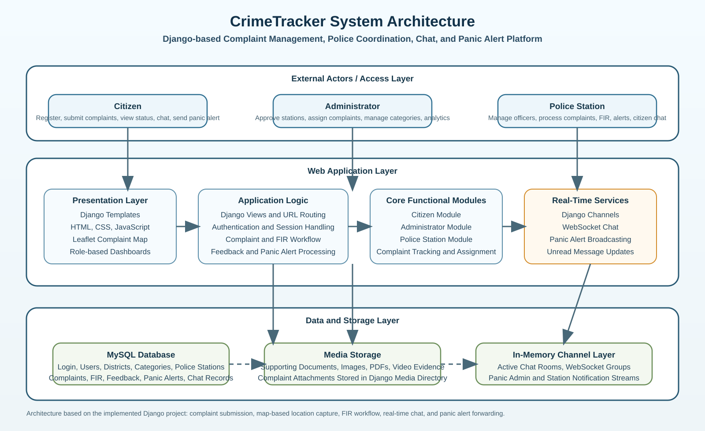

# 🚨 CrimeTracker — Online Crime Reporting & Case Management System

A full-stack, role-based web application that digitizes the crime reporting and investigation workflow — from a citizen filing a complaint to a police officer closing the case — with real-time chat, live panic alerts, and geolocation-based crime mapping.

Built with **Python, Django, Django Channels (WebSockets), MySQL, and Leaflet.js**.

---

## 📖 Overview

CrimeTracker connects four types of users — **Citizens, Police Officers, Police Stations, and Admins** — on a single platform so that crime reporting, FIR management, and case tracking don't have to happen over disconnected phone calls and paperwork.

A citizen can file a complaint with an exact map location and supporting evidence, an admin routes it to the right police station, an officer is assigned, an FIR is generated, and the citizen can track the case status and chat with the assigned officer in real time — all from the browser.

## ✨ Key Features

- **Role-based access control** for 4 distinct portals: Citizen, Admin, Police Station, Police Officer
- **Complaint lifecycle management** — submission → station assignment → officer assignment → investigation updates → FIR generation → resolution
- **Real-time chat** between citizens and assigned officers, and between stations, built on Django Channels (WebSockets)
- **Live panic alert system** — citizens can trigger an alert that is instantly forwarded to the nearest police station
- **Geolocation-based crime mapping** using Leaflet.js — every complaint is pinned with latitude/longitude for spot visualization
- **District & place-wise crime hotspot analytics** for admins
- **FIR creation and viewing** with case-specific documentation
- **Officer transfer and station management** tools for admins
- **Feedback system** with admin replies
- **OTP-based password reset** via email
- **Evidence upload** support (images, video, documents) attached to complaints

## 🏗️ System Architecture

<p align="center">
  
</p>

Role-specific data flow diagrams are also included in the repo:
- [`citizen_dfd.svg`](citizen_dfd.svg) — Citizen complaint flow
- [`police_station_dfd.svg`](police_station_dfd.svg) — Station assignment & FIR flow
- [`admin_dfd.svg`](admin_dfd.svg) — Admin oversight flow

## 🛠️ Tech Stack

| Layer | Technology |
|---|---|
| Backend | Python, Django |
| Real-time | Django Channels, WebSockets, Daphne (ASGI) |
| Database | MySQL |
| Frontend | HTML5, CSS3, Bootstrap, JavaScript |
| Maps | Leaflet.js (geolocation & crime spot visualization) |
| Email/OTP | smtplib (SMTP) |

## 👥 User Roles

| Role | Capabilities |
|---|---|
| **Citizen** | Register, submit complaints with location & evidence, track case status, chat with assigned officer, send panic alerts, give feedback |
| **Police Officer** | View assigned cases, post investigation updates, generate/view FIRs, chat with citizens |
| **Police Station** | Register, manage officers, assign complaints to officers, view panic alerts, handle station-level chat |
| **Admin** | Approve stations, manage categories & districts, assign complaints to stations, view analytics/hotspots, handle feedback, forward panic alerts |

## 🚀 Getting Started

### Prerequisites
- Python 3.9+
- MySQL Server

### Installation

```bash
# Clone the repository
git clone https://github.com/BinilBabuGeorge/CrimeTracker-Project.git
cd CrimeTracker-Project

# Create and activate a virtual environment
python -m venv venv
venv\Scripts\activate      # Windows
source venv/bin/activate   # macOS/Linux

# Install dependencies
pip install django channels daphne mysqlclient
```

### Database Setup

1. Create a MySQL database (e.g. `crime_tracker_db`).
2. Import the provided schema:
   ```bash
   mysql -u <username> -p crime_tracker_db < crime_tracker_db.sql
   ```
3. Update the `DATABASES` section in `crime_tracker/settings.py` with your MySQL credentials.

### Run the App

```bash
python manage.py migrate
python manage.py runserver
```

Visit `http://127.0.0.1:8000/` in your browser.

> **Note:** This project uses Django Channels for WebSocket features (live chat, panic alerts). For production, run it behind Daphne/an ASGI server rather than the default `runserver`.

## ⚠️ Before Deploying

- `SECRET_KEY` and database credentials are currently defined directly in `settings.py`. Move these to environment variables (e.g. using `python-decouple` or `django-environ`) before deploying publicly.
- Set `DEBUG = False` in production.

## 📌 Roadmap

- [ ] Add automated tests
- [ ] Dockerize for easier setup
- [ ] Deploy a live demo

## 👤 Author

**Binil Babu George**
📧 binilbabugeorge2001@gmail.com
🔗 [LinkedIn](https://www.linkedin.com/in/binil-babu-180658281/) · [Portfolio](https://binil-babu-portfolio.netlify.app)

---

⭐ If you found this project useful, consider giving it a star!
